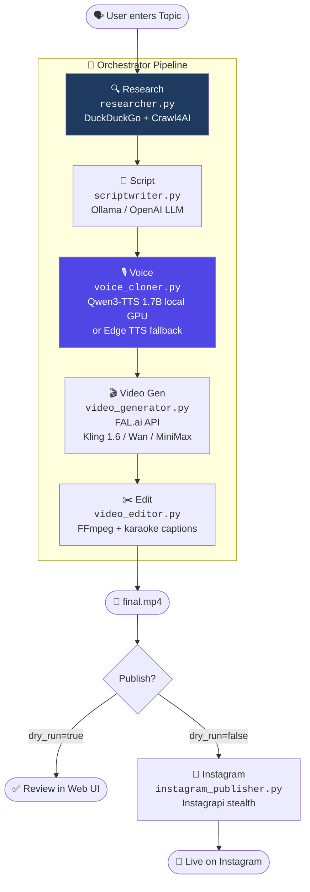
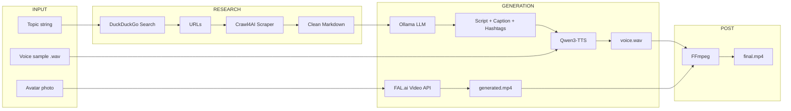

# 🎬 OpenCreator

Automated AI video content pipeline — from topic to finished reel, running mostly locally.

**Research → Script → Voice Clone → Video → Edit**

---

## Pipeline Flow



### Data Flow Detail



---

## Quick Start

```bash
# 1. Clone & install
git clone git@github.com:pankaj-mahaur/OpenCreator.git
cd OpenCreator
pip install -r requirements.txt

# 2. Configure
cp .env.example .env
# Edit .env — add FAL_API_KEY, set VOICE_CLONING=true

# 3. Setup AI Scraper
python -m playwright install chromium

# 4. Run
python main.py --topic "Why AI will change everything"

# Or start the Web UI
python main.py --serve
# Open http://127.0.0.1:8501
```

---

## Requirements

- **Python 3.10+**
- **[Ollama](https://ollama.ai)** running locally — `ollama serve`
- **[FFmpeg](https://ffmpeg.org)** installed and in PATH
- **FAL.ai API key** — for video generation ([get one here](https://fal.ai))
- **Avatar photo** at `assets/my_photo.png`
- **CUDA GPU** (optional) — required for local Qwen3-TTS voice cloning

---

## Voice Cloning Setup

Uses **Qwen3-TTS-12Hz-1.7B-Base** for zero-shot voice cloning, fully local on GPU.

### 1. Record your voice sample
Record **10–20 seconds** of clear speech → save to `voice_samples/my_voice.wav`

### 2. Enable in `.env`
```env
VOICE_CLONING=true
QWEN_TTS_MODEL=Qwen/Qwen3-TTS-12Hz-1.7B-Base
QWEN_TTS_DEVICE=cuda:0

# Optional — paste exact words from your recording for best quality
VOICE_CLONE_REF_TEXT=Your exact words here
```

### 3. Test
```bash
python tests/test_qwen_tts.py
```

---

## CLI Usage

```bash
python main.py --topic "AI news"                  # Full pipeline
python main.py --topic "AI news" --dry-run         # Skip publish
python main.py --topic "AI news" --model wan       # Use Wan 2.1
python main.py --list                              # List all past runs
python main.py --serve                             # Start web UI
```

---

## Configuration (`.env`)

### LLM
| Variable | Description | Default |
|---|---|---|
| `LLM_PROVIDER` | `ollama` or `openai` | `ollama` |
| `OLLAMA_MODEL` | Ollama model for scripts | `llama3.2:3b` |
| `OPENAI_API_KEY` | OpenAI key (if using openai) | — |

### Voice
| Variable | Description | Default |
|---|---|---|
| `VOICE_CLONING` | Enable local Qwen3-TTS | `false` |
| `QWEN_TTS_MODEL` | HuggingFace model ID | `Qwen/Qwen3-TTS-12Hz-1.7B-Base` |
| `QWEN_TTS_DEVICE` | Torch device | `cuda:0` |
| `VOICE_CLONE_REF_TEXT` | Transcript for ICL mode | `` |
| `EDGE_TTS_VOICE` | Fallback TTS voice | `en-US-ChristopherNeural` |

### Video
| Variable | Description | Default |
|---|---|---|
| `FAL_API_KEY` | FAL.ai key (required) | — |
| `VIDEO_GEN_MODEL` | `kling-1.6`, `wan`, `minimax` | `kling-1.6` |
| `AVATAR_PHOTO_PATH` | Avatar image path | `assets/my_photo.png` |

### Publish
| Variable | Description |
|---|---|
| `IG_USERNAME` | Instagram username |
| `IG_PASSWORD` | Instagram password |

---

## Project Structure

```
OpenCreator/
├── main.py                     # CLI entry point + web server launcher
├── config.py                   # Central configuration (loads .env)
├── orchestrator.py             # Pipeline coordinator (5 sequential steps)
├── requirements.txt            # Python dependencies
├── .env.example                # Config template
│
├── modules/                    # Core pipeline modules
│   ├── researcher.py           #   DuckDuckGo search + Crawl4AI scraping
│   ├── scriptwriter.py         #   Ollama/OpenAI script generation
│   ├── voice_cloner.py         #   Qwen3-TTS local cloning + Edge TTS fallback
│   ├── video_generator.py      #   FAL.ai video API (Kling / Wan / MiniMax)
│   ├── video_editor.py         #   FFmpeg compositing + ASS karaoke captions
│   ├── instagram_publisher.py  #   Instagrapi stealth publisher
│   ├── uploader.py             #   Cloudflare R2 upload
│   └── gpu_manager.py          #   VRAM management utilities
│
├── dashboard/                  # Web UI
│   ├── app.py                  #   Flask backend + REST API
│   ├── static/
│   │   └── style.css           #   Glassmorphism dark theme
│   └── templates/
│       └── index.html          #   Premium UI with live progress
│
├── tests/                      # Test scripts
│   └── test_qwen_tts.py        #   Voice cloning smoke test
│
├── assets/                     # Static assets
│   └── my_photo.png            #   Avatar photo for video gen
│
├── voice_samples/              # Voice reference audio
│   └── my_voice.wav            #   Your voice for cloning
│
└── output/                     # Generated runs (auto-created)
    └── <run_id>/
        ├── state.json          #   Pipeline state
        ├── voice.mp3           #   Generated speech
        ├── generated.mp4       #   Raw video from API
        └── final.mp4           #   Final video with captions
```

---

## Web UI

Start with `python main.py --serve`, then open **http://127.0.0.1:8501**

Features:
- Enter topic & generate videos
- Real-time pipeline progress with step indicators
- Video preview + download
- Run history browser

---

## License

MIT
