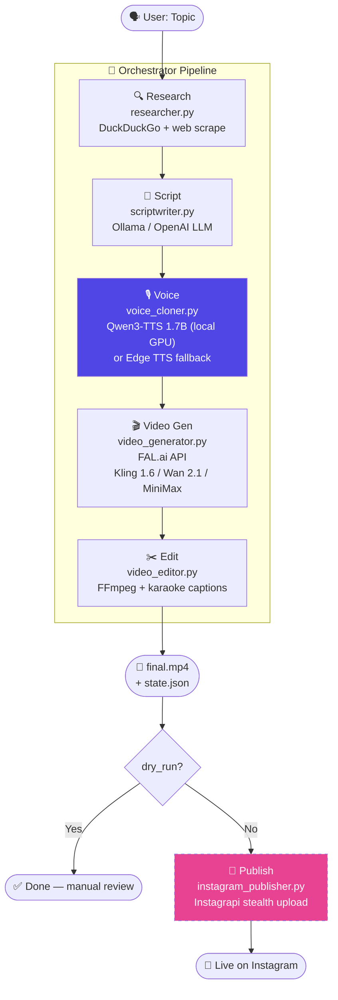

# 🎬 OpenCreator

Automated AI video content pipeline — from topic to finished reel, running mostly locally.

**Research → Script → Voice → Video → Edit → Publish**

---

## Pipeline Flow



> **Purple** = just implemented this session · **Dashed pink** = module exists, not yet connected to pipeline

---

## What It Does

| Step | Module | Status |
|---|---|---|
| 🔍 Research | `researcher.py` — DuckDuckGo + web scrape | ✅ Working |
| 📝 Script | `scriptwriter.py` — Ollama / OpenAI | ✅ Working |
| 🎙️ Voice | `voice_cloner.py` — **Qwen3-TTS 1.7B local** + Edge TTS fallback | ✅ Working |
| 🎬 Video Gen | `video_generator.py` — FAL.ai (Kling / Wan / MiniMax) | ✅ Working |
| ✂️ Edit | `video_editor.py` — FFmpeg + ASS captions | ✅ Working |
| 🌐 Web UI | `dashboard/app.py` — Flask dark-theme UI | ✅ Working |
| 📱 Publish | `instagram_publisher.py` — Instagrapi stealth | ⚠️ Module ready, not wired up |
| ☁️ Upload | `uploader.py` — Cloudflare R2 (S3) | ⚠️ Module ready, not wired up |

---

## Roadmap — What's Left

### 🔴 High Priority
- [ ] **Wire up Instagram publishing** — `instagram_publisher.py` exists and works in isolation, just needs to be called at end of `orchestrator.py` when `dry_run=False`
- [ ] **End-to-end test** — run a full topic → final.mp4 → Instagram publish cycle

### 🟡 Medium Priority
- [ ] **B-roll / stock footage** — `PEXELS_API_KEY` is in config, needs a `broll.py` module + editor integration
- [ ] **Scheduler / automation** — cron or APScheduler to post on a schedule (e.g. daily at 9am)
- [ ] **Web UI publish button** — trigger Instagram publish directly from the web UI after review
- [ ] **Cloudflare R2 integration** — wire up `uploader.py` for video hosting/backup

### 🟢 Nice to Have
- [ ] **TikTok / YouTube Shorts publishing** — new publisher modules
- [ ] **Batch mode** — run multiple topics in sequence overnight
- [ ] **Script editing in Web UI** — let user tweak the script before voice is generated
- [ ] **Voice preview in Web UI** — play generated audio before committing to video
- [ ] **Multi-language support** — Qwen3-TTS supports 10 languages natively

---

## Quick Start

```bash
# 1. Clone & install
git clone git@github.com:pankaj-mahaur/OpenCreator.git
cd OpenCreator
pip install -r requirements.txt

# 2. Configure
cp .env.example .env
# Edit .env — add FAL_API_KEY, set VOICE_CLONING=true for voice cloning

# 3. Run
python main.py --topic "Why AI will change everything"

# Or start the Web UI
python main.py --serve
# Open http://127.0.0.1:8501
```

---

## Requirements

- **Python 3.10+**
- **[Ollama](https://ollama.ai)** running locally — `ollama serve`
- **[FFmpeg](https://ffmpeg.org)** installed and in PATH
- **FAL.ai API key** — for video generation ([get one here](https://fal.ai))
- **Avatar photo** at `assets/my_photo.png`
- **CUDA GPU** (optional) — required for local Qwen3-TTS voice cloning

---

## Voice Cloning Setup

OpenCreator uses **Qwen3-TTS-12Hz-1.7B-Base** for zero-shot voice cloning, running fully locally on your GPU.

### 1. Record your voice sample
Record yourself speaking for **10–20 seconds** of clear audio.
Save it to: `voice_samples/my_voice.wav`

### 2. Enable cloning in `.env`
```env
VOICE_CLONING=true
QWEN_TTS_MODEL=Qwen/Qwen3-TTS-12Hz-1.7B-Base
QWEN_TTS_DEVICE=cuda:0

# Paste the exact words you spoke — enables ICL mode for best quality
VOICE_CLONE_REF_TEXT=Your exact words here
```

### 3. First run downloads the model (~3.5 GB, cached after that)
```bash
python _test_qwen_tts.py  # Quick smoke test
```

> Without `VOICE_CLONE_REF_TEXT` the model uses x-vector mode (works, slightly less accurate). Adding the transcript unlocks best quality.

---

## CLI Usage

```bash
python main.py --topic "AI news"                  # Full pipeline
python main.py --topic "AI news" --dry-run         # Skip publish
python main.py --topic "AI news" --model wan       # Use Wan 2.1
python main.py --list                              # List all past runs
python main.py --serve                             # Start web UI
```

---

## Configuration (`.env`)

### LLM
| Variable | Description | Default |
|---|---|---|
| `LLM_PROVIDER` | `ollama` or `openai` | `ollama` |
| `OLLAMA_MODEL` | Ollama model for scripts | `llama3.2:3b` |
| `OPENAI_API_KEY` | OpenAI key (if using openai) | — |

### Voice
| Variable | Description | Default |
|---|---|---|
| `VOICE_CLONING` | Enable local Qwen3-TTS | `false` |
| `QWEN_TTS_MODEL` | HuggingFace model ID | `Qwen/Qwen3-TTS-12Hz-1.7B-Base` |
| `QWEN_TTS_DEVICE` | Torch device | `cuda:0` |
| `VOICE_CLONE_REF_TEXT` | Transcript for ICL mode | `` |
| `EDGE_TTS_VOICE` | Fallback TTS voice | `en-US-ChristopherNeural` |

### Video
| Variable | Description | Default |
|---|---|---|
| `FAL_API_KEY` | FAL.ai key (required) | — |
| `VIDEO_GEN_MODEL` | `kling-1.6`, `wan`, `minimax` | `kling-1.6` |
| `AVATAR_PHOTO_PATH` | Avatar image path | `assets/my_photo.png` |

### Publish (optional)
| Variable | Description |
|---|---|
| `IG_USERNAME` | Instagram username |
| `IG_PASSWORD` | Instagram password |

---

## Project Structure

```
├── main.py                  # CLI entry point
├── config.py                # Central configuration
├── orchestrator.py          # Pipeline coordinator
├── modules/
│   ├── researcher.py        # DuckDuckGo research + scraping
│   ├── scriptwriter.py      # Ollama/OpenAI script generation
│   ├── voice_cloner.py      # Qwen3-TTS (local GPU) + Edge TTS fallback
│   ├── video_generator.py   # FAL.ai video API (Kling / Wan / MiniMax)
│   ├── video_editor.py      # FFmpeg compositing + ASS captions
│   ├── instagram_publisher.py  # Instagrapi stealth publisher (not wired)
│   └── uploader.py          # Cloudflare R2 uploader (not wired)
├── dashboard/
│   ├── app.py               # Flask web backend
│   └── templates/
│       └── index.html       # Dark-theme web UI
├── voice_samples/
│   └── my_voice.wav         # Your reference audio for cloning
├── assets/
│   └── my_photo.png         # Avatar photo for video gen
└── .env.example             # Config template
```

---

## License

MIT
